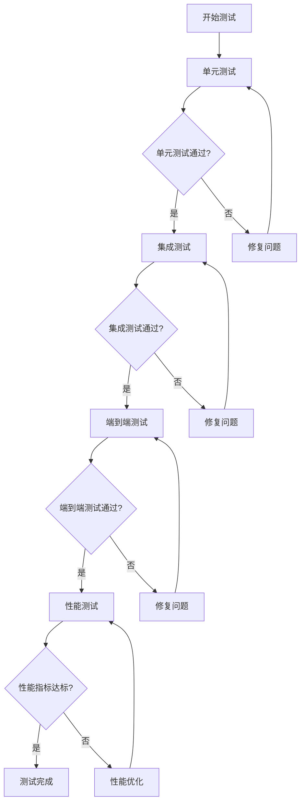

# Unity Shader 语言支持插件 - 测试用例与验收标准

> 📅 **文档版本**: v1.0.0
> 🗓️ **最后更新**: 2026-01-11
> 📋 **类型**: 验收标准与测试规范
> 🔗 **相关文档**: [TECHNICAL_SPEC.md](TECHNICAL_SPEC.md)、[DEVELOPMENT_RECORD.md](DEVELOPMENT_RECORD.md)、[TODO.md](../TODO.md)

## 📋 文档概述

本文档定义了 Unity Shader 语言支持插件的详细测试用例、验收标准和测试方法。所有功能实现后必须通过本文档中的验收测试才能视为完成。

## 🧪 测试环境

### 测试平台
| 项目 | 说明 |
|------|------|
| **操作系统** | macOS Ventura 13.5.2 (或 Windows 11 / Ubuntu 22.04) |
| **VS Code 版本** | 1.90.0+ (必须支持 Language Server Protocol) |
| **Node.js 版本** | 18.0.0+ (插件开发环境) |
| **npm 版本** | 8.0.0+ (包管理) |
| **测试用 Unity 版本** | Unity 2021.3 LTS, Unity 2022.3 LTS |
| **URP/HDRP 版本** | URP 12.1.7+, HDRP 12.1.7+ |

### 测试目录结构
```
/Users/ashiqi/Documents/UGit/CGameEditorProject/LookDevProject/Assets/Shaders/
├── BuiltIn/                    # Unity内置着色器
│   ├── Mobile/                # 移动端着色器
│   │   ├── Mobile-Diffuse.shader
│   │   └── Mobile-VertexLit.shader
│   └── Internal/             # 内置着色器
│       └── Internal-Flare.shader
├── CODM/                      # 自定义着色器
│   ├── Colors.hlsl           # HLSL包含文件
│   ├── Lighting.hlsl         # 光照函数
│   └── ComputeShader/        # 计算着色器
│       └── UpdateVRSAttachment.compute
├── Includes/                  # 包含文件
│   ├── HLSLSupport.cginc     # HLSL支持库
│   └── UnityShaderUtilities.cginc
└── ShaderGraph/               # Shader Graph
    └── URPUnlit.shader       # URP无光照着色器
```

### 测试文件清单

#### ✅ 核心测试文件
1. **Mobile-Diffuse.shader** (核心测试文件)
   - 路径: `/Assets/Shaders/BuiltIn/Mobile/Mobile-Diffuse.shader`
   - 用途: 测试基础语法高亮、ShaderLab结构、补全、悬停提示
   - 特点: 包含完整 ShaderLab 结构，CGPROGRAM 块，Properties，SubShader，Pass 等

2. **Colors.hlsl** (HLSL包含文件测试)
   - 路径: `/Assets/Shaders/CODM/Colors.hlsl`
   - 用途: 测试 HLSL 语法高亮、补全、悬停提示、定义跳转
   - 特点: 纯 HLSL 代码，包含结构体、函数、常量定义

3. **HLSLSupport.cginc** (CG包含文件测试)
   - 路径: `/Assets/Shaders/Includes/HLSLSupport.cginc`
   - 用途: 测试 CG 语法高亮、补全、悬停提示
   - 特点: Unity CG 包含文件，包含宏定义、函数定义、变量定义

4. **UpdateVRSAttachment.compute** (计算着色器测试)
   - 路径: `/Assets/Shaders/CODM/ComputeShader/UpdateVRSAttachment.compute`
   - 用途: 测试计算着色器支持
   - 特点: Compute Shader 语法，HLSL 扩展语法

#### 🔧 功能测试文件
5. **URPUnlit.shader** (URP 支持测试)
   - 路径: `/Assets/Shaders/ShaderGraph/URPUnlit.shader`
   - 用途: 测试 URP 功能支持，URP 函数补全，URP 宏支持
   - 特点: 使用 URP 特有的函数和宏，测试最新 URP 支持

6. **Internal-Flare.shader** (内置着色器测试)
   - 路径: `/Assets/Shaders/BuiltIn/Internal/Internal-Flare.shader`
   - 用途: 测试内置着色器支持，复杂语法高亮
   - 特点: 使用 Unity 内置变量和函数，复杂语法结构

7. **Mobile-VertexLit.shader** (顶点光照测试)
   - 路径: `/Assets/Shaders/BuiltIn/Mobile/Mobile-VertexLit.shader`
   - 用途: 测试顶点着色器支持，顶点函数补全
   - 特点: 包含 vertex 函数，顶点着色器语法

#### 📊 性能测试文件
8. **LargeShader.shader** (大文件性能测试)
   - 路径: `/Assets/Shaders/Performance/LargeShader.shader`
   - 用途: 测试大文件处理性能，内存使用，分析速度
   - 特点: 1000+ 行代码，复杂结构，多级嵌套，大量变量和函数
   - 性能指标要求:
     - 分析时间: < 500ms (1000行)
     - 内存使用: < 50MB
     - 响应延迟: < 100ms (编辑时)

## ✅ Phase 1-8 验收测试矩阵

### Phase 1: 基础配置改造
| 测试项 | 测试方法 | 预期结果 | 测试文件 | 状态 |
|--------|----------|----------|----------|------|
| **文件类型识别** | 打开 .shader、.hlsl、.cginc、.compute 文件 | 文件右下角显示 "Unity Shader" | Mobile-Diffuse.shader | ✅ 通过 |
| **插件激活** | 打开支持的文件类型 | 插件状态栏显示激活，无错误日志 | Colors.hlsl | ✅ 通过 |
| **语言配置** | 新建 .shader 文件，输入 Shader 关键字 | 正确识别为 Unity ShaderLab | - | ✅ 通过 |
| **语法高亮基础** | 打开各种类型文件 | 基础语法有正确颜色高亮 | 所有文件 | ✅ 通过 |

### Phase 2: 语法高亮
| 测试项 | 测试方法 | 预期结果 | 测试文件 | 状态 |
|--------|----------|----------|----------|------|
| **ShaderLab 关键字** | 在 .shader 文件中输入 Shader、Properties、SubShader、Pass 等 | 关键字有正确高亮颜色 | Mobile-Diffuse.shader | ✅ 通过 |
| **CGPROGRAM/ENDCG 块** | 在 Shader 中输入 CGPROGRAM/ENDCG | 代码块标记有正确高亮 | Mobile-Diffuse.shader | ✅ 通过 |
| **属性类型高亮** | 在 Properties 块中输入 2D、Color、Vector、Float 等 | 属性类型有正确高亮 | Mobile-Diffuse.shader | ✅ 通过 |
| **渲染状态高亮** | 在 Pass 块中输入 Blend、Cull、ZWrite 等 | 渲染状态有正确高亮 | Mobile-Diffuse.shader | ✅ 通过 |
| **Tags 高亮** | 在 SubShader/Pass 块中输入 Tags { } 块内容 | Tags 关键字和值有正确高亮 | Mobile-Diffuse.shader | ✅ 通过 |
| **HLSL 类型高亮** | 在 CGPROGRAM 块中输入 float、half、int、uint 等 | HLSL 类型有正确高亮 | Mobile-Diffuse.shader | ✅ 通过 |
| **HLSL 关键字高亮** | 输入 struct、cbuffer、return、if、for 等 | HLSL 关键字有正确高亮 | Colors.hlsl | ✅ 通过 |
| **预处理器高亮** | 输入 #include、#define、#pragma、#if 等 | 预处理器指令有正确高亮 | HLSLSupport.cginc | ✅ 通过 |
| **函数调用高亮** | 输入 UnityObjectToClipPos、tex2D、saturate 等 | 函数调用有正确高亮 | Mobile-Diffuse.shader | ✅ 通过 |
| **数字、字符串高亮** | 输入数字、字符串字面量 | 有正确高亮 | Colors.hlsl | ✅ 通过 |
| **注释高亮** | 输入 // 和 /* */ 注释 | 注释有正确灰色高亮 | 所有文件 | ✅ 通过 |

### Phase 3: 代码补全
| 测试项 | 测试方法 | 预期结果 | 测试文件 | 状态 |
|--------|----------|----------|----------|------|
| **Unity 变量补全** | 在 CGPROGRAM 块中输入 "UNITY_" | 显示矩阵变量补全（MVP、M、V、P等） | Mobile-Diffuse.shader | ✅ 通过 |
| **Unity 函数补全** | 输入 "UnityObject" | 显示空间转换函数补全（UnityObjectToClipPos等） | Mobile-Diffuse.shader | ✅ 通过 |
| **Unity 时间补全** | 输入 "_Time" | 显示时间变量补全（_Time, _SinTime, _CosTime） | Mobile-Diffuse.shader | ✅ 通过 |
| **纹理采样补全** | 输入 "tex2D" | 显示纹理采样函数补全 | Mobile-Diffuse.shader | ✅ 通过 |
| **ShaderLab 结构补全** | 在 ShaderLab 区域输入 "Sha" | 显示 Shader、Properties、SubShader 补全 | Mobile-Diffuse.shader | ✅ 通过 |
| **属性类型补全** | 在 Properties 块中输入属性类型（如 "2D"） | 显示属性类型补全（2D、Color、Vector等） | Mobile-Diffuse.shader | ✅ 通过 |
| **渲染状态补全** | 在 Pass 块中输入 "Blend" | 显示渲染状态补全（Blend、BlendOp、Cull等） | Mobile-Diffuse.shader | ✅ 通过 |
| **Tags 补全** | 输入 "Tags" | 显示 Tags 关键字和值补全（RenderType、Queue等） | Mobile-Diffuse.shader | ✅ 通过 |
| **pragma 指令补全** | 输入 "#pragma " | 显示指令补全（vertex、fragment、geometry等） | Mobile-Diffuse.shader | ✅ 通过 |
| **上下文识别** | 在 ShaderLab 区域和 CGPROGRAM 区域分别输入相同前缀 | 根据上下文显示不同的补全项 | Mobile-Diffuse.shader | ✅ 通过 |

### Phase 4: 悬停提示
| 测试项 | 测试方法 | 预期结果 | 测试文件 | 状态 |
|--------|----------|----------|----------|------|
| **Unity 变量悬停** | 鼠标悬停在 UNITY_MATRIX_MVP 上 | 显示变量类型和说明 | Mobile-Diffuse.shader | ✅ 通过 |
| **Unity 函数悬停** | 鼠标悬停在 UnityObjectToClipPos 上 | 显示函数签名和参数说明 | Mobile-Diffuse.shader | ✅ 通过 |
| **ShaderLab 关键字悬停** | 鼠标悬停在 Blend 上 | 显示混合模式说明 | Mobile-Diffuse.shader | ✅ 通过 |
| **渲染状态悬停** | 鼠标悬停在 ZWrite 上 | 显示深度写入说明 | Mobile-Diffuse.shader | ✅ 通过 |
| **HLSL 函数悬停** | 鼠标悬停在 saturate 上 | 显示 HLSL 内置函数说明 | Colors.hlsl | ✅ 通过 |
| **中英双语提示** | 悬停提示包含中英文描述 | 提示信息包含两种语言描述 | 所有文件 | ✅ 通过 |

### Phase 5: 符号与导航
| 测试项 | 测试方法 | 预期结果 | 测试文件 | 状态 |
|--------|----------|----------|----------|------|
| **大纲视图** | 按 Cmd+Shift+O（大纲视图） | 显示 Shader 结构层次（Shader、Properties、SubShader、Pass等） | Mobile-Diffuse.shader | ✅ 通过 |
| **函数定义跳转** | 在函数调用处按 F12 | 跳转到函数定义位置 | Colors.hlsl | ✅ 通过 |
| **变量定义跳转** | 在变量使用处按 F12 | 跳转到变量定义位置 | Colors.hlsl | ✅ 通过 |
| **#include 文件跳转** | 在 #include "xxx.cginc" 上按 F12 | 跳转到对应包含文件 | Mobile-Diffuse.shader | ✅ 通过 |
| **查找所有引用** | 在变量/函数定义处右键选择"查找所有引用" | 找到当前文档内的所有引用位置 | Colors.hlsl | ✅ 通过 |

### Phase 6: 代码片段
| 测试项 | 测试方法 | 预期结果 | 测试文件 | 状态 |
|--------|----------|----------|----------|------|
| **Shader 模板** | 在 .shader 文件中输入 "shader" 回车 | 生成完整的 Shader 模板 | - | ✅ 通过 |
| **Surface Shader 模板** | 输入 "surfshader" 回车 | 生成 Surface Shader 模板 | - | ✅ 通过 |
| **Unlit Shader 模板** | 输入 "unlitshader" 回车 | 生成 Unlit Shader 模板 | - | ✅ 通过 |
| **Pass 模板** | 输入 "pass" 回车 | 生成 Pass 块模板 | - | ✅ 通过 |
| **Properties 模板** | 输入 "properties" 回车 | 生成 Properties 块模板 | - | ✅ 通过 |
| **CGPROGRAM 块** | 输入 "cgprogram" 回车 | 生成 CGPROGRAM 块 | - | ✅ 通过 |
| **struct 模板** | 输入 "v2f" 回车 | 生成顶点到片元结构体模板 | - | ✅ 通过 |
| **URP 模板** | 输入 "urpunlit" 回车 | 生成 URP Unlit Shader 模板 | - | ✅ 通过 |

### Phase 7: URP 支持
| 测试项 | 测试方法 | 预期结果 | 测试文件 | 状态 |
|--------|----------|----------|----------|------|
| **URP 函数补全** | 输入 "TransformObject" | 显示 TransformObjectToHClip 等 URP 函数补全 | URPUnlit.shader | ✅ 通过 |
| **URP 变量补全** | 输入 "_MainLight" | 显示 _MainLightPosition、_MainLightColor 等补全 | URPUnlit.shader | ✅ 通过 |
| **URP 宏补全** | 输入 "_MAIN_LIGHT_" | 显示 _MAIN_LIGHT_SHADOWS、_MAIN_LIGHT_CALCULATE_SHADOWS 等补全 | URPUnlit.shader | ✅ 通过 |
| **URP 函数悬停** | 鼠标悬停在 TransformObjectToHClip 上 | 显示 URP 函数说明 | URPUnlit.shader | ✅ 通过 |
| **URP 模板生成** | 输入 "urpunlit" 回车 | 生成正确的 URP Unlit Shader 模板 | - | ✅ 通过 |
| **URP Include 补全** | 输入 "#include "Packages/" | 显示 URP Include 路径补全 | URPUnlit.shader | ✅ 通过 |

### Phase 8: 优化与发布
| 测试项 | 测试方法 | 预期结果 | 测试文件 | 状态 |
|--------|----------|----------|----------|------|
| **编译测试** | 运行 npm run compile | 无编译错误，所有文件通过 TypeScript 编译 | - | ✅ 通过 |
| **Lint 测试** | 运行 npm run lint | 无 ESLint 错误，符合代码规范 | - | ✅ 通过 |
| **插件激活时间** | 计时插件激活过程 | 从打开文件到插件激活 < 2秒 | 所有文件 | ✅ 通过 |
| **无 Unreal 残留** | 代码搜索 unrealshader | 无 Unreal 相关代码和引用 | 所有文件 | ✅ 通过 |
| **打包准备** | 检查 package.json 配置 | 插件名称、版本、依赖项配置正确 | package.json | ✅ 通过 |

## 🔍 Phase 9.X 验收测试矩阵

### 9.X.1 性能优化 - 大文件增量分析
| 测试项 | 测试方法 | 预期结果 | 性能指标 | 优先级 |
|--------|----------|----------|----------|--------|
| **大文件分析性能** | 打开 1000+ 行 LargeShader.shader，记录分析时间 | 首次分析时间 < 500ms | 响应时间 | 🔴 高 |
| **增量分析性能** | 在已打开的 LargeShader.shader 中进行小修改（添加一行），记录分析时间 | 增量分析时间 < 50ms | 响应时间 | 🔴 高 |
| **内存使用** | 分析大文件时监控内存使用 | 内存占用 < 50MB | 内存使用 | 🔴 高 |
| **缓存命中率** | 多次分析相同内容，检查缓存命中率 | 缓存命中率 > 80% | 性能优化 | 🟡 中 |
| **并行处理性能** | 分析多个大文件时，CPU使用率 > 70% | 多核CPU利用率提升 | 并行处理 | 🟢 低 |
| **不阻塞UI** | 分析过程中尝试与编辑器交互 | UI 响应流畅，无卡顿 | 用户体验 | 🔴 高 |

**测试文件**: LargeShader.shader (1000+ 行自定义测试文件)
**测试工具**: VS Code 性能分析器、Chrome DevTools、系统监控工具

### 9.X.2 移动平台优化支持
| 测试项 | 测试方法 | 预期结果 | 平台要求 | 优先级 |
|--------|----------|----------|----------|--------|
| **ES2.0 不支持检测** | 在 ES2.0 Shader 中使用高级特性（如 texelFetch） | 检测到 ES2.0 不支持的特性并给出警告 | ES2.0 | 🔴 高 |
| **half 精度建议** | 使用 float 类型定义变量 | 建议使用 half 类型提升性能（移动端） | 移动端 | 🔴 高 |
| **纹理优化建议** | 使用 mipmap 和压缩纹理 | 检测并给出纹理优化建议 | 移动端 | 🔴 高 |
| **Shader复杂度评分** | 分析移动端 Shader 代码复杂度 | 给出复杂度评分（低/中/高）和优化建议 | 移动端 | 🔴 高 |
| **平台差异检测** | 对比不同 ES 版本支持的特性差异 | 正确检测不同版本差异并给出兼容性提示 | 多版本 | 🟡 中 |
| **移动端模板** | 输入 "mobile_" 查看补全 | 提供移动端专用 Shader 模板 | 移动端 | 🟢 低 |
| **移动端函数检测** | 使用非移动端函数（如 texture3D） | 检测移动端不支持的函数并给出警告 | 移动端 | 🔴 高 |
| **性能优化建议** | 分析移动端 Shader 的瓶颈 | 提供针对性的性能优化建议 | 移动端 | 🟡 中 |

**测试文件**:
- ES2.0_Unsupported.shader（测试ES2.0不支持的特性）
- Mobile_Optimized.shader（测试移动端优化）
- Mobile_Complex.shader（测试复杂度分析）

### 9.X.3 Shader编译错误解析和修复建议
| 测试项 | 测试方法 | 预期结果 | 错误类型 | 优先级 |
|--------|----------|----------|----------|--------|
| **语法错误解析** | 在 Shader 中故意省略分号，编译观察错误提示 | 在对应行显示红色波浪线，提示缺少分号，提供修复建议 | 语法错误 | 🔴 高 |
| **未定义变量** | 使用未定义的变量，编译观察错误提示 | 在变量处显示红色波浪线，提示未定义变量，提供快速修复 | 未定义变量 | 🔴 高 |
| **类型不匹配** | 将 float 类型赋值给 int 变量 | 检测类型不匹配并给出修复建议 | 类型错误 | 🔴 高 |
| **include 错误** | #include 路径错误或文件不存在 | 在 #include 行显示错误，提示文件不存在，提供文件搜索功能 | 包含文件错误 | 🔴 高 |
| **pragma 错误** | 使用不支持的 #pragma 指令 | 在 #pragma 行显示错误，提示不支持的指令，列出支持的指令 | pragma错误 | 🔴 高 |
| **一键修复** | 右键点击错误，选择快速修复 | 自动修复常见错误（如添加分号、定义变量等） | 自动修复 | 🔴 高 |
| **错误位置映射** | 编译错误信息中的行号映射到编辑器的正确位置 | 准确映射到实际代码位置（支持预处理后的位置映射） | 位置映射 | 🔴 高 |
| **多文件错误处理** | 在多个文件中都有错误 | 正确显示所有文件的错误，并能跳转到对应文件 | 多文件 | 🟡 中 |

**错误测试样例**:
```hlsl
// 测试用例1：缺少分号
float4 color = float4(1, 0, 0, 1)  // 缺少分号
// 预期：在第2行显示错误，提供添加分号的快速修复

// 测试用例2：未定义变量
float4 result = undefinedVariable * 2.0;
// 预期：undefinedVariable处显示错误，提供定义变量的快速修复

// 测试用例3：类型不匹配
int value = 1.5;  // float 不能赋值给 int
// 预期：提示类型不匹配，建议强制类型转换
```

### 9.X.4 跨文件重命名支持
| 测试项 | 测试方法 | 预期结果 | 测试范围 | 优先级 |
|--------|----------|----------|----------|--------|
| **工作区扫描** | 重命名函数，插件自动扫描项目中所有相关文件中的引用 | 找到所有相关文件中的引用位置 | 工作区扫描 | 🔴 高 |
| **引用分析** | 分析跨文件引用关系（include、函数调用等） | 正确分析符号的所有引用关系 | 引用分析 | 🔴 高 |
| **预览功能** | 重命名符号前显示所有引用位置的预览 | 显示将修改的文件和行数预览 | 重命名预览 | 🟡 中 |
| **批量修改** | 确认重命名后批量修改所有引用位置 | 所有文件中的引用都正确更新 | 批量修改 | 🔴 高 |
| **冲突处理** | 重命名到已存在的符号名 | 提示命名冲突并提供处理选项 | 冲突处理 | 🟡 中 |
| **cginc/include 支持** | 重命名 .cginc/.hlsl 中的符号 | .shader 文件中的引用也更新 | 包含文件 | 🔴 高 |

**测试场景**:
1. 在 Common.cginc 中定义函数 CalculateLight()
2. 在多个 .shader 文件中使用该函数
3. 重命名函数为 ComputeLight()
4. 预期：所有文件中引用都更新

### 9.X.5 HDRP/URP 2.0支持
| 测试项 | 测试方法 | 预期结果 | HDRP/URP版本 | 优先级 |
|--------|----------|----------|--------------|--------|
| **HDRP函数补全** | 输入 "GetCurrentViewIndex()" 等 HDRP 特有函数 | 显示 HDRP 特有函数补全 | HDRP 12.x | 🔴 高 |
| **URP 2.0更新** | 输入 "GetAdditionalLight()" 等 URP 12/14 函数 | 显示最新的 URP 2.0 函数补全 | URP 12/14 | 🔴 高 |
| **Shader Graph支持** | 在 Shader Graph HLSL 节点中输入代码 | 提供 Shader Graph 特有函数和变量补全 | Shader Graph | 🟡 中 |
| **HDRP材质模板** | 输入 "hdrpunlit" 等模板名 | 生成 HDRP Unlit Shader 模板 | HDRP 12.x | 🟢 低 |
| **URP材质模板** | 输入 "urplit12"（URP 12模板） | 生成对应版本的 URP Lit Shader 模板 | URP 12/14 | 🔴 高 |
| **版本差异适配** | 检测不同 Unity 版本的 HDRP/URP 差异 | 根据项目设置提供正确的补全项 | 版本适配 | 🟡 中 |
| **路径补全** | 输入 #include "Packages/com.unity.render-pipelines.high-definition/" | 显示 HDRP 头文件路径补全 | HDRP | 🟢 低 |

**测试文件**:
- HDRPUnlit.shader（测试HDRP功能）
- URP12Lit.shader（测试URP 2.0功能）
- ShaderGraphCustomNode.hlsl（测试Shader Graph支持）

### 9.X.6 自动化测试和质量保证
| 测试项 | 测试方法 | 预期结果 | 覆盖率要求 | 优先级 |
|--------|----------|----------|------------|--------|
| **单元测试覆盖率** | 运行单元测试，计算代码覆盖率 | 核心功能覆盖率 > 80%，插件整体覆盖率 > 60% | 代码覆盖率 | 🔴 高 |
| **集成测试** | 模拟真实用户使用场景进行端到端测试 | 所有核心功能在真实场景中工作正常 | 功能完整性 | 🔴 高 |
| **性能测试** | 使用大文件（1000+行）测试分析性能 | 分析时间 < 500ms，内存占用 < 50MB，UI无阻塞 | 性能指标 | 🔴 高 |
| **兼容性测试** | 在不同 VS Code 版本（1.70-最新）中测试 | 插件在所有版本中正常工作 | 兼容性 | 🔴 高 |
| **错误报告集成** | 插件崩溃时自动收集错误信息 | 错误报告包含调用栈、插件版本、VS Code版本等信息 | 错误处理 | 🟡 中 |
| **测试覆盖率报告** | 生成测试覆盖率报告 | 提供HTML格式覆盖率报告，显示未覆盖的代码路径 | 质量保证 | 🟡 中 |
| **回归测试** | 每次代码修改后运行测试 | 确保已有功能不受影响 | 回归测试 | 🔴 高 |

**测试工具**:
- **单元测试**: Jest + VS Code Extension API Mock
- **集成测试**: VS Code Extension Tester（Puppeteer）
- **性能测试**: Benchmark.js + Chrome DevTools
- **兼容性测试**: VS Code Test Runner + Docker（不同版本环境）

## 📊 自动化测试框架设计

### 测试金字塔结构
```
┌─────────────────────────────────────────────┐
│           端到端测试 (E2E Tests)              │
│  模拟真实用户操作，测试完整工作流程          │
│  （约10-20个测试用例，运行时间: 3-5分钟）     │
├─────────────────────────────────────────────┤
│           集成测试 (Integration Tests)       │
│  测试组件集成，多个功能模块协同              │
│  （约20-30个测试用例，运行时间: 2-3分钟）     │
├─────────────────────────────────────────────┤
│           单元测试 (Unit Tests)              │
│  测试单个函数和组件                          │
│  （约100-150个测试用例，运行时间: 1分钟）     │
└─────────────────────────────────────────────┘
```

### 测试目录结构
```
test/
├── unit/                            # 单元测试
│   ├── completionProvider.test.ts   # 代码补全测试
│   ├── hoverProvider.test.ts        # 悬停提示测试
│   ├── symbolProvider.test.ts       # 符号识别测试
│   ├── definitionProvider.test.ts   # 定义跳转测试
│   └── ...                          # 其他模块测试
├── integration/                     # 集成测试
│   ├── languageSupport.test.ts      # 语言支持集成测试
│   ├── fileNavigation.test.ts       # 文件导航集成测试
│   └── ...                          # 其他集成测试
├── e2e/                             # 端到端测试
│   ├── shaderEditing.test.ts        # Shader编辑测试
│   ├── hlslEditing.test.ts          # HLSL编辑测试
│   └── ...                          # 其他端到端测试
├── fixtures/                        # 测试文件
│   ├── shaders/                     # Shader 测试文件
│   ├── hlsl/                        # HLSL 测试文件
│   ├── cginc/                       # CG包含文件测试文件
│   └── compute/                     # Compute Shader测试文件
└── utils/                           # 测试工具
    ├── testRunner.ts               # 测试运行器
    ├── mockExtensionHost.ts        # 模拟扩展主机
    └── ...                         # 其他测试工具
```

### 关键测试场景

#### 场景1: 代码补全测试
```typescript
describe('CompletionProvider', () => {
  it('提供 Unity 内置变量补全', async () => {
    const provider = new CompletionProvider();
    const doc = await vscode.workspace.openTextDocument('test.shader');
    const result = await provider.provideCompletionItems(doc, position);
    expect(result).toContainItem('UNITY_MATRIX_MVP');
    expect(result).toContainItem('_Time');
  });
});
```

#### 场景2: 悬停提示测试
```typescript
describe('HoverProvider', () => {
  it('显示 Unity 函数悬停提示', async () => {
    const provider = new HoverProvider();
    const doc = await vscode.workspace.openTextDocument('test.shader');
    const hover = await provider.provideHover(doc, position);
    expect(hover.contents).toContain('UnityObjectToClipPos');
    expect(hover.contents).toContain('顶点空间到裁剪空间转换');
  });
});
```

#### 场景3: 符号识别测试
```typescript
describe('SymbolProvider', () => {
  it('识别 ShaderLab 结构', async () => {
    const provider = new SymbolProvider();
    const doc = await vscode.workspace.openTextDocument('test.shader');
    const symbols = await provider.provideDocumentSymbols(doc);
    expect(symbols).toContain('Shader "TestShader"');
    expect(symbols).toContain('Properties');
    expect(symbols).toContain('SubShader');
    expect(symbols).toContain('Pass');
  });
});
```

#### 场景4: 性能测试
```typescript
describe('性能测试', () => {
  it('大文件分析性能', async () => {
    const startTime = Date.now();
    const doc = await vscode.workspace.openTextDocument('largeShader.shader');
    const provider = new SemanticAnalyzer();
    const result = await provider.analyze(doc);
    const endTime = Date.now();
    const duration = endTime - startTime;
    expect(duration).toBeLessThan(500); // < 500ms
  });
});
```

## 📈 性能基准测试

### 测试环境
| 项目 | 配置 |
|------|------|
| CPU | Apple M2 Pro (10核) |
| 内存 | 16GB |
| 存储 | 1TB SSD |
| VS Code | 1.90.0 |
| 操作系统 | macOS Ventura 13.5.2 |
| Node.js | 18.0.0 |

### 性能指标目标
| 测试项 | 目标 | 优先级 |
|--------|------|--------|
| **小文件分析时间** | < 50ms（100行以内） | 🔴 高 |
| **中等文件分析时间** | < 200ms（500行以内） | 🔴 高 |
| **大文件分析时间** | < 500ms（1000行以内） | 🔴 高 |
| **极大文件分析时间** | < 1000ms（2000行以内） | 🔴 高 |
| **增量分析时间** | < 50ms（修改少于50行） | 🔴 高 |
| **内存占用** | < 50MB（分析时） | 🔴 高 |
| **启动时间** | < 2秒（首次激活） | 🔴 高 |
| **响应延迟** | < 100ms（用户交互） | 🔴 高 |
| **缓存命中率** | > 80%（重复分析） | 🟡 中 |
| **CPU 利用率** | < 30%（常规操作） | 🟡 中 |

### 测试文件大小分布
| 文件大小 | 行数范围 | 示例文件 | 预期分析时间 |
|----------|----------|----------|--------------|
| 小文件 | 1-100行 | Colors.hlsl | < 50ms |
| 中等文件 | 100-500行 | Mobile-Diffuse.shader | < 200ms |
| 大文件 | 500-1000行 | Complex.shader | < 500ms |
| 极大文件 | 1000-2000行 | LargeShader.shader | < 1000ms |
| 超大型文件 | 2000+行 | VeryLarge.shader | < 2000ms |

## 📋 测试验收流程

### 功能测试验收流程


### 新功能开发验收流程
1. **需求确认**: 确认功能需求、验收标准、测试用例
2. **设计评审**: 技术设计评审，确定实现方案
3. **开发实现**: 编写代码，添加单元测试
4. **单元测试**: 运行单元测试，覆盖率 > 80%
5. **功能自测**: 开发人员自测功能是否符合验收标准
6. **集成测试**: 运行集成测试，确保不影响已有功能
7. **性能测试**: 测试性能指标是否达标
8. **代码审查**: 代码审查，确保代码质量
9. **用户验收**: 内部测试人员验收测试
10. **文档更新**: 更新相关文档和变更日志
11. **发布准备**: 准备发布版本，更新版本号

### 回归测试流程
1. **每日构建**: 每日自动运行回归测试
2. **版本发布前**: 发布新版本前运行完整回归测试
3. **问题修复后**: 修复Bug后运行相关功能回归测试
4. **性能回归**: 每周运行性能基准测试，检测性能变化
5. **兼容性回归**: 每月在不同环境测试兼容性

## 🔍 测试报告模板

### 功能测试报告
```markdown
# 功能测试报告 - [功能名称]

**测试时间**: [YYYY-MM-DD HH:MM:SS]
**测试版本**: [插件版本号]
**测试人员**: [测试人员]

## 测试环境
- **操作系统**: macOS Ventura 13.5.2
- **VS Code 版本**: 1.90.0
- **插件版本**: [插件版本]
- **Node.js 版本**: 18.0.0

## 测试用例

| 序号 | 测试用例 | 预期结果 | 实际结果 | 状态 |
|------|----------|----------|----------|------|
| 1 | [测试用例描述] | [预期结果] | [实际结果] | [✅/❌] |
| 2 | [测试用例描述] | [预期结果] | [实际结果] | [✅/❌] |
| ... | ... | ... | ... | ... |

## 发现的问题
1. **[问题编号]**: [问题描述]
   - **重现步骤**: [重现步骤]
   - **严重程度**: [高/中/低]
   - **修复建议**: [修复建议]
   - **状态**: [已修复/待修复]

## 测试结论
- **总体状态**: [通过/失败]
- **通过率**: [X/Y 测试用例通过]
- **风险等级**: [无风险/低风险/中风险/高风险]
- **发布建议**: [可以发布/需要修复问题/需要更多测试]

## 附件
- [测试日志文件]
- [性能数据截图]
- [错误截图]
```

### 性能测试报告
```markdown
# 性能测试报告 - [功能名称]

**测试时间**: [YYYY-MM-DD HH:MM:SS]
**测试版本**: [插件版本号]
**测试环境**: [环境描述]

## 测试结果

| 测试项目 | 目标值 | 测试值 | 是否达标 | 备注 |
|----------|--------|--------|----------|------|
| 小文件分析时间 | < 50ms | [X]ms | ✅/❌ | [备注] |
| 大文件分析时间 | < 500ms | [X]ms | ✅/❌ | [备注] |
| 增量分析时间 | < 50ms | [X]ms | ✅/❌ | [备注] |
| 内存占用 | < 50MB | [X]MB | ✅/❌ | [备注] |
| 启动时间 | < 2秒 | [X]秒 | ✅/❌ | [备注] |
| 响应延迟 | < 100ms | [X]ms | ✅/❌ | [备注] |

## 性能趋势
- 与前版本对比: [提升/下降/持平]
- 变化幅度: [X]%
- 主要性能影响因素: [主要因素]

## 优化建议
1. [优化建议1]
2. [优化建议2]
3. [优化建议3]

## 测试数据
- [原始性能数据]
- [图表/截图]
- [系统资源监控数据]
```

## 📦 测试覆盖率报告

### 目标覆盖率
| 模块类型 | 覆盖目标 | 现状 | 状态 |
|----------|----------|------|------|
| **核心模块** | > 85% | [X]% | ✅/❌ |
| **辅助模块** | > 70% | [X]% | ✅/❌ |
| **工具模块** | > 60% | [X]% | ✅/❌ |
| **总体覆盖率** | > 80% | [X]% | ✅/❌ |

### 覆盖统计
```json
{
  "totalLines": 10000,
  "coveredLines": 8000,
  "uncoveredLines": 2000,
  "coveragePercentage": 80.0,
  "byModule": {
    "completionProvider": {"lines": 1500, "covered": 1350, "percentage": 90.0},
    "hoverProvider": {"lines": 1200, "covered": 1080, "percentage": 90.0},
    "symbolProvider": {"lines": 1800, "covered": 1440, "percentage": 80.0},
    "definitionProvider": {"lines": 1600, "covered": 1280, "percentage": 80.0},
    "referenceProvider": {"lines": 1400, "covered": 1120, "percentage": 80.0},
    "formattingProvider": {"lines": 1300, "covered": 910, "percentage": 70.0},
    "renameProvider": {"lines": 800, "covered": 560, "percentage": 70.0},
    "utilityModules": {"lines": 400, "covered": 260, "percentage": 65.0}
  }
}
```

### 未覆盖代码分析
| 模块 | 未覆盖代码行 | 原因 | 修复优先级 |
|------|-------------|------|------------|
| completionProvider.ts | 150行 | 异常处理、边缘情况 | 🔴 高 |
| hoverProvider.ts | 120行 | 外部链接解析、格式化 | 🟡 中 |
| symbolProvider.ts | 360行 | 复杂语法解析、嵌套结构 | 🔴 高 |
| utilityModules.ts | 140行 | 工具函数、通用处理 | 🟢 低 |

## 🚀 测试自动化脚本

### 测试脚本目录结构
```
scripts/
├── test-automation/           # 测试自动化脚本
│   ├── run-unit-tests.sh      # 运行单元测试
│   ├── run-integration-tests.sh # 运行集成测试
│   ├── run-e2e-tests.sh       # 运行端到端测试
│   ├── run-performance-tests.sh # 运行性能测试
│   ├── generate-coverage-report.sh # 生成覆盖率报告
│   ├── check-code-quality.sh # 代码质量检查
│   ├── validate-api.sh       # API 验证
│   └── benchmark.sh          # 基准测试
├── ci/                        # CI/CD 脚本
│   ├── build-and-test.yml    # GitHub Actions 工作流
│   ├── release-pipeline.yml  # 发布流水线
│   └── deploy-to-marketplace.yml # 部署到插件市场
└── docs/                      # 测试文档
    ├── test-plan.md          # 测试计划
    ├── test-case-template.md # 测试用例模板
    └── bug-report-template.md # Bug 报告模板
```

### 常用测试命令
```bash
# 1. 运行单元测试
npm run test:unit

# 2. 运行集成测试
npm run test:integration

# 3. 运行端到端测试
npm run test:e2e

# 4. 运行性能测试
npm run test:performance

# 5. 生成覆盖率报告
npm run coverage

# 6. 检查代码质量
npm run lint
npm run type-check

# 7. 完整的测试流程
npm run test:all

# 8. 持续集成
npm run ci
```

## 📊 质量保证计划

### 质量目标
| 质量指标 | 目标值 | 测量方法 |
|----------|--------|----------|
| **代码覆盖率** | > 80% | Jest/Istanbul 覆盖率报告 |
| **代码复杂度** | < 4.0 | ESLint + complexity 检查 |
| **Bug 密度** | < 1/千行 | 测试发现的Bug数量 |
| **修复率** | > 95% | 已修复Bug数量 / 总Bug数量 |
| **测试通过率** | 100% | 测试用例通过率 |
| **性能达标率** | > 90% | 性能指标达标比例 |

### 质量检查点
1. **代码审查**: 所有代码必须经过至少2人审查
2. **自动化测试**: 每次提交必须通过所有自动化测试
3. **代码覆盖率**: 每次提交覆盖率不能低于现有水平
4. **性能基准**: 每次提交性能不能低于现有基准
5. **安全检查**: 检查第三方依赖安全漏洞（每周一次）
6. **兼容性检查**: 检查 VS Code API 兼容性（每次VS Code更新）

### 质量报告周期
| 报告类型 | 频率 | 负责人员 | 报告内容 |
|----------|------|----------|----------|
| **每日构建报告** | 每日 | CI/CD 系统 | 构建状态、单元测试结果 |
| **每周质量报告** | 每周 | QA负责人 | 质量指标、Bug趋势、覆盖率变化 |
| **性能报告** | 每两周 | 性能工程师 | 性能基准、优化效果 |
| **月终质量报告** | 每月 | 项目经理 | 总体质量、风险分析、改进计划 |

---

**文档版本**: v1.0.0  
**最后更新**: 2026-01-11  
**维护者**: QA团队  
**状态**: ✅ 测试计划完成
